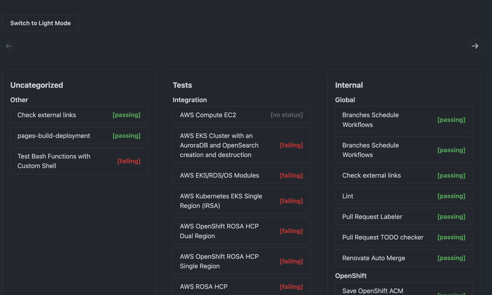

# GitHub Actions Dashboard UserScript

This UserScript enhances the GitHub Actions overview page for any public repository by providing a modern, grouped, and visually appealing dashboard of all workflows.

## Disclaimer

> [!IMPORTANT]
> **This project was fully created by GPT-4.1 using GitHub Copilot in Agentic mode.**
> All code, structure, and documentation were generated by AI, with user guidance and frustration.
> This was a slackday project to play around with agentic ai but also improve a pain point of mine.

## Conclusion on Agentic AI

Own opinion, while it helps to quickly get things up and running, it can be frustrating to see how the agentic ai develops backwards during usage and doesn't really learn from its mistakes and forget about previous prompts destroying everything along the way. With GitHub Copilot mode, it's difficult to move prompts backwards, it's easier to commit every other prompt and jump that way.

It's often easier and quicker to fix things yourself than let the model fix it.
Overall was a fun sideproject but the bigger the code base and more complex the code, the less useful it got.

## Features

- Replaces the default public repo Actions overview with a responsive dashboard.
- Groups workflows by their naming convention (`Group - Category - Name`).
- Displays each workflow as a clickable box linking to its Actions UI.
- Shows the current status (e.g., passing, failing) next to each workflow using the workflow badge.
- Supports both light and dark mode, with a toggle and persistent theme choice.
- Automatically works on any repository's `/actions` page.
- Build script compiles everything into a single Tampermonkey-compatible userscript.

## Installation

1. Install the [Tampermonkey](https://www.tampermonkey.net/) browser extension if you haven't already.
2. Use the built JavaScript from the releases.

Alternative:

2. Clone or download this repository.
3. Run `./build-tampermonkey.sh` to generate the final userscript in `output/github-actions-dashboard.user.js`.
4. In Tampermonkey, create a new script and paste the contents of `output/github-actions-dashboard.user.js`.
5. Save the script.
6. Visit any GitHub repository's `/actions` page to see the dashboard in action.

## How it Works

- The script detects the current repository from the URL and fetches its workflows using the GitHub API.
- Workflows are grouped and displayed in a grid, with clickable links to their Actions UI.
- The status of each workflow is fetched from its badge SVG and shown next to the name.
- The dashboard is styled to blend with GitHub's UI and supports both light and dark themes.
- The codebase is modular for easy development, but the build script outputs a single userscript for Tampermonkey.

## Development

- Source files are in the `src/` directory:
  - `dashboard-style.css` — All dashboard CSS
  - `dashboard-utils.js` — Utility functions (e.g., robust fetch)
  - `dashboard-ui.js` — UI rendering and DOM logic
  - `index.js` — Main entry point
- The build script (`build-tampermonkey.sh`) concatenates and processes these files into `output/github-actions-dashboard.user.js`.
- Edit the source files for development, then run the build script to update the userscript.
